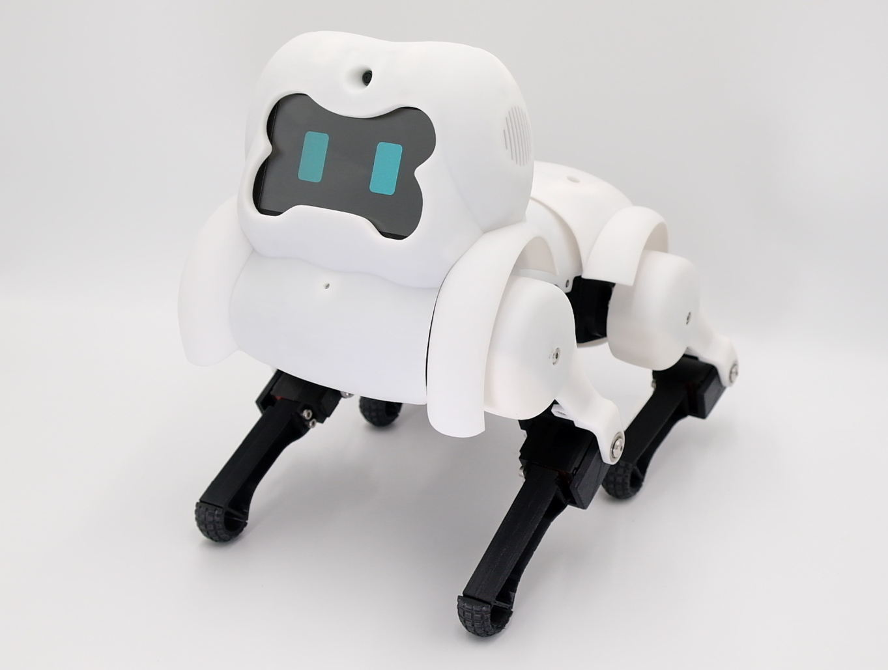

# SpotLink

SpotLink is a quadruped robot prototype that can recognize and respond to human expressions while providing video call services. This project is a reaserch in the field of Human-Robot Interaction, focused on designing and developing a social robot suitable for video call situations, and to provide insight and knowledge for future research reference from experience.

# Download

The full mechanism 3D parts can be downloaded on [Thingiverse](https://www.thingiverse.com/thing:6167898).

# Full Paper

The link will be attached here once the paper is published.

# Attributions

The mechanism parts are adapted from SpotMicro model, which is originally developed by Deok-yeon Kim and released on [Thingiverse](https://www.thingiverse.com/thing:3445283).
The eletronics and the programs are adapted from SpotMicroAI, which is originally developed by Fran Ferri and released on [SpotMicroAI](https://spotmicroai.readthedocs.io/en/latest/).

# License

[Creative Commons Attribution](https://creativecommons.org/licenses/by/3.0/)

  
